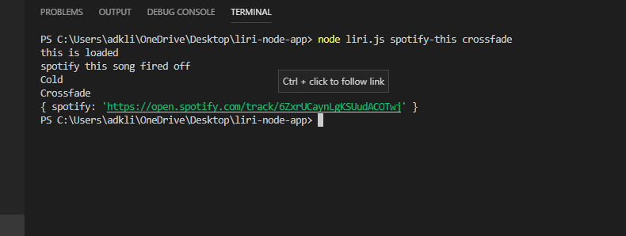
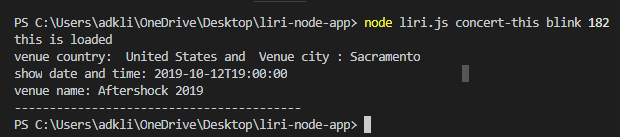

# liri-node-app

Hello, Welcome to Liri, a basic application coded by Alojzy to pull information from users input (ex. song, movie, concerts). To start choose your client from "Spotify-this", "concert-this", "movie-this", "Do-what-it-Says" enter information related to the topic and our app will provide the rest!

## Spotify-This

A Spotify client that will return song data:
* Title, even if user entered lowercase
* Band
* Album
* Link to open track in Spotify

## concert-this

An bandsintown client that will return concert data:
* Venue Country and City 
* show date and time (most current show)
* Venue name
